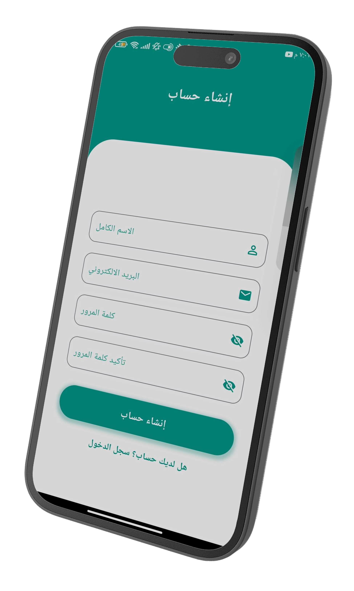
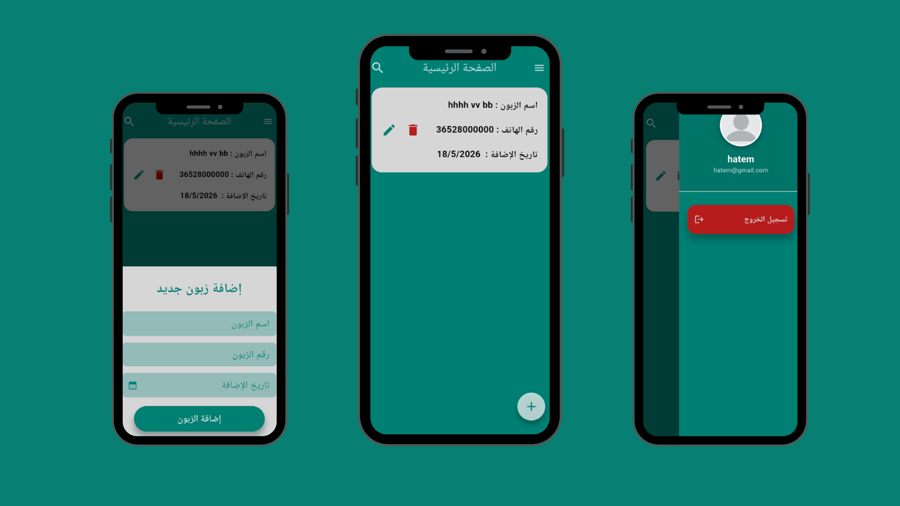

<div align="center">

# Dyoun — ديون

### *Track debts. Get paid. Stay organized.*

A complete Flutter application for managing customer debts with ease — from logging purchases to generating PDF reports.

[](https://flutter.dev)
[](https://dart.dev)
[](https://firebase.google.com)
[](https://pub.dev/packages/hive)
[](https://bloclibrary.dev)
[](LICENSE)

</div>

---

## 📖 Table of Contents

- [About](#-about)
- [Features](#-features)
- [Tech Stack](#-tech-stack)
- [Architecture](#-architecture)
- [Screenshots](#-screenshots)
- [Download APK](#-download-apk)
- [Getting Started](#-getting-started)
- [Localization](#-localization)
- [Contributing](#-contributing)
- [License](#-license)

---

## About

**Dyoun (ديون)** is a Flutter app designed to help shop owners and individuals manage customer debts efficiently. Log what a customer owes, track their purchases over time, mark items as settled, and export a full PDF summary — all in one clean, bilingual interface.

---

## Features

| Feature | Description |
|---|---|
| 🔐 **Secure Login** | Email & password authentication via Firebase Auth |
| 👤 **Customer Management** | Add and manage customer profiles linked to your account |
| 📦 **Debt Logging** | Record items purchased on credit with price and date |
| ✅ **Settlement Tracking** | Mark individual debts as paid when customers settle |
| 📄 **PDF Export** | Generate a full PDF report of all settled and pending debts per customer |
| 🌍 **Arabic & English** | Full Arabic and English support with no hardcoded strings |
| 🌙 **Offline-First** | Local data stored with Hive, keyed per user account |

---

## Tech Stack

| Layer | Technology |
|---|---|
| **Framework** | Flutter / Dart |
| **Authentication** | Firebase Auth |
| **Remote Database** | Cloud Firestore |
| **Local Database** | Hive |
| **State Management** | BLoC / Cubit |
| **PDF Generation** | pdf / printing |
| **Localization** | flutter_localizations + ARB files |
| **Architecture** | Clean Architecture + MVVM |

---

## Architecture

Dyoun follows **Clean Architecture** with a clear separation of concerns across 3 layers, combined with the **MVVM** pattern:

```
lib/
├── core/
│   ├── errors/
│   ├── helpers/
│   ├── services/
│   └── utils/
├── features/
│   ├── auth/
│   │   ├── data/                # Firebase data sources & repositories
│   │   ├── domain/              # Entities, use cases, repo interfaces
│   │   └── presentation/        # BLoC / Cubit + UI screens
│   ├── customers/
│   │   ├── data/
│   │   ├── domain/
│   │   └── presentation/
│   ├── debts/
│   │   ├── data/
│   │   ├── domain/
│   │   └── presentation/
│   └── paid_debts/
│       ├── data/
│       ├── domain/
│       └── presentation/
└── main.dart
```

**Data Flow:**
```
UI (Presentation) → BLoC/Cubit → Use Cases (Domain) → Repository → Data Sources (Firebase / Hive)
```

> Each customer's Hive box is keyed to the logged-in user's `uid`, ensuring complete data isolation between accounts.

---

## Screenshots

| Login | Home | Add Customer |
|:---:|:---:|:---:|
|  |  |  |

| Debt List | Paid Debts | PDF Report |
|:---:|:---:|:---:|
|  |  |  |

---

## Download APK

<div align="center">

> **[Download APK](https://drive.google.com/file/d/1pg7QUxEZLysQSo2jHqhTS1tT_p_c-3fF/view?usp=sharing)**

<br/>

Scan to download:


</div>

---

## Getting Started

### Prerequisites

- [Flutter SDK](https://docs.flutter.dev/get-started/install) (latest stable)
- Android Studio / VS Code
- A Firebase project (Auth + Firestore enabled)

### Installation

1. **Clone the repository:**
   ```bash
   git clone https://github.com/YourUsername/dyoun.git
   cd dyoun
   ```

2. **Install dependencies:**
   ```bash
   flutter pub get
   ```

3. **Add Firebase config files:**
   - Place `google-services.json` inside `android/app/`
   - Place `GoogleService-Info.plist` inside `ios/Runner/`

4. **Generate Hive adapters:**
   ```bash
   flutter pub run build_runner build --delete-conflicting-outputs
   ```

5. **Run the app:**
   ```bash
   flutter run
   ```

---

## Localization

The app supports **Arabic** and **English** with zero hardcoded strings. All text is defined in ARB files under `lib/l10n/` and switches automatically based on device locale or user preference.

---

## Contributing

Contributions are welcome! For major changes, please open an issue first to discuss what you'd like to change.

1. Fork the repository
2. Create your feature branch:
   ```bash
   git checkout -b feature/AmazingFeature
   ```
3. Commit your changes:
   ```bash
   git commit -m 'Add some AmazingFeature'
   ```
4. Push to the branch:
   ```bash
   git push origin feature/AmazingFeature
   ```
5. Open a Pull Request

---
## Connect

| | |
|---|---|
| GitHub | [github.com/YourUsername](https://github.com/YourUsername) |
| LinkedIn | [linkedin.com/in/yourprofile](https://linkedin.com/in/yourprofile) |
| Gmail | [your@email.com](mailto:your@email.com) |

## License

This project is licensed under the **MIT License** — you are free to use, modify, and distribute the code. See the [LICENSE](LICENSE) file for details.

---

<div align="center">
  <sub>Built with ❤️ using Flutter</sub>
</div>
